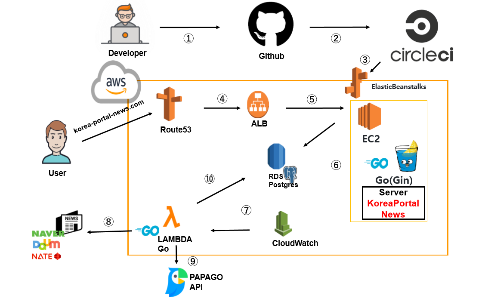

# KOREA PORTAL NEWS
韓国の有名なニュースポータルサイトのランキングニュースをまとめて閲覧するWEBアプリケーションです。
韓国で最もユーザ数が多く、影響力のあるポータル「NAVER」「DAUM」「NATE」のランキングニュースを提供しております。

韓国語がわからないが、韓国のニュースが見たいと思われている、
日本人の皆様にもご活用いただくため、現在、「NAVER」のみ日本語の翻訳機能も提供しております。

## URL
https://korea-portal-news.com/
※現在、サーバー停止状態です。

## 使用技術
1. Go + Gin(web framework)　clean architecture適用
2. AWS (Route53, ALB, EC2, RDS, LAMBDA, ClOUDWATCH, ElasticBeanstalks)
3. circleci 追加予定※2020.05.28未適用　
4. Bootstrap, ajax, jquery
5. PAPAGO API(翻訳)
6. Google Oauth API(ログイン) 

## アーキテクチャ

1. ソース作成・GitHubにアップロード
2. GitHubにアップロードされると、CircleCiからフッキングし、テスト実施　追加予定※2020.05.28未適用　
3. AWS ElasticBeanstalksにてデプロイ
4. ユーザが"korea-portal-news"に接続すると、ALBにリクエストを送信、ALBにてHTTPS認証
5. LBルールに従い、EC2にリクエスト振り分け
6. RDSに保存されてあるデータ(ニュースなど)取得し、ユーザにサービス
7. 一定時間をトリガーとしてLAMBDA実施 
8. LAMBDAに登録されてある、クローリング処理を実施し、各ポータルサイトを対象にニュース取得
9. 取得した韓国語のニュースを、PAPAGO翻訳APIにて日本語ニュースも取得
10. ニュースデータ保存
